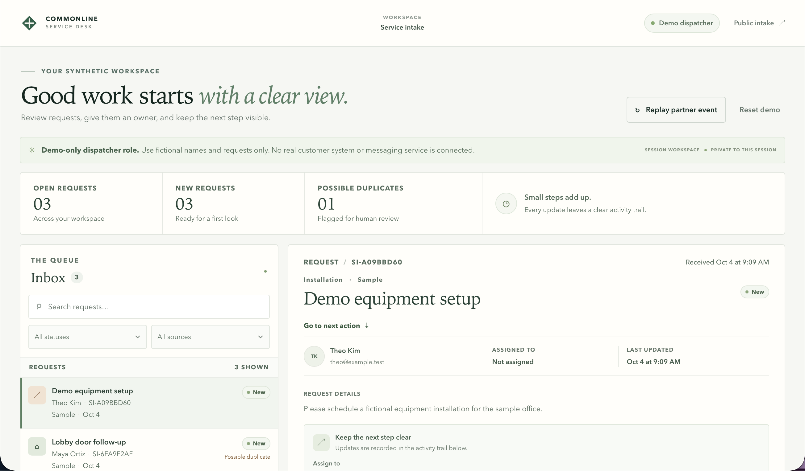
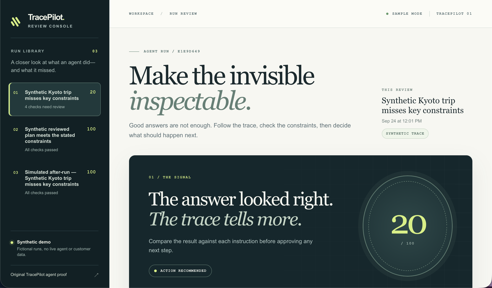

# Eduardo Hernandez

### Web Applications & Workflow Automation

I turn operational problems into practical applications, with a focus on clear interfaces, reliable data and traceable decisions.

**Focus:** full-stack web applications · AI/workflow automation · software quality and application troubleshooting

## Featured projects

### 1. [Service Intake Workbench](https://github.com/bullyopswork/service-intake-workbench)

**Problem:** service requests need a clear owner, next step and history.

A full-stack service desk that takes a request from public intake through staff assignment, work and resolution. PostgreSQL stores the workflow and activity trail; signed partner ingestion handles repeated events without creating duplicate requests.

**Stack:** Next.js · React · TypeScript · PostgreSQL

[Live demo](https://service-intake-workbench.vercel.app/) · [Source](https://github.com/bullyopswork/service-intake-workbench) · [Integration checks](https://github.com/bullyopswork/service-intake-workbench/actions)

### 2. [TracePilot Review Console](https://github.com/bullyopswork/tracepilot-review-console)

**Problem:** an AI answer can sound useful while missing the task's requirements.

A full-stack review workspace for inspecting traces, checking constraints, recording a human decision and comparing before/after results. Its interactive walkthrough uses synthetic traces and deterministic checks, keeping evaluation separate from the original live-agent integration below.

**Stack:** Next.js · React · TypeScript · PostgreSQL

[Live demo](https://tracepilot-review-console.vercel.app/) · [Source](https://github.com/bullyopswork/tracepilot-review-console) · [API tests](https://github.com/bullyopswork/tracepilot-review-console/blob/main/tests/api.test.ts)

### 3. [Closeout: Proof of Handoff](https://github.com/bullyopswork/closeout-proof-of-handoff)

**Problem:** stale or mislinked evidence can make unfinished work look complete.

A responsive JavaScript evidence-review workflow with explicit human approval, guarded state transitions and an auditable handoff. Browser regression tests exercise the interface and workflow boundaries.

**Stack:** JavaScript · HTML/CSS · Web Crypto · Playwright

[Live demo](https://closeout-proof-of-handoff.vercel.app/) · [Source](https://github.com/bullyopswork/closeout-proof-of-handoff) · [Browser tests](https://github.com/bullyopswork/closeout-proof-of-handoff/blob/main/tests/run-production-regression.mjs) · [Walkthrough](https://youtu.be/juAD0BmmExc)

### 4. [TracePilot](https://github.com/bullyopswork/tracepilot)

**Problem:** troubleshooting an agent requires evidence of what its tools and model actually did.

A Python agent/operator demonstration integrating Google ADK, Gemini and Phoenix tracing. It retrieves trace evidence, checks task outcomes and produces a diagnosis with a refined next task.

**Stack:** Python · Google ADK · Gemini · OpenInference/Phoenix · MCP

[Source and setup](https://github.com/bullyopswork/tracepilot) · [Proof workflow](https://github.com/bullyopswork/tracepilot/blob/main/proof_gate/README.md)

### 5. [Excel Cleanup & Payment Reconciliation](https://github.com/bullyopswork/excel-payment-reconciliation)

**Problem:** messy order and payment exports obscure discrepancies and create manual rework.

A Python workflow that cleans exports, matches payments, flags exceptions and generates a five-sheet Excel workbook. A reproducible fixture test checks totals, row counts and workbook structure.

**Stack:** Python · openpyxl · CSV/Excel · unittest

[Source and sample workbook](https://github.com/bullyopswork/excel-payment-reconciliation) · [Validation test](https://github.com/bullyopswork/excel-payment-reconciliation/blob/main/tests/test_excel_project.py)

## Business application case study

### All County Court Notification App

A court-notification application designed to combine court-notice intake, case/document matching, staff review and automated SMS/email reminders for defendants and co-signers.

**Product focus:** document-processing workflows · evidence matching · human review · notification automation

Private-source business application; this case study describes the intended product design.

## How I work

I combine operations experience with AI-assisted development, clear workflow design and reproducible checks. Public walkthroughs use demo data; each repository documents its implementation, scope and verification steps.

Interested in opportunities across web development, workflow automation, QA and application support.

[Browse all public repositories](https://github.com/bullyopswork?tab=repositories)
